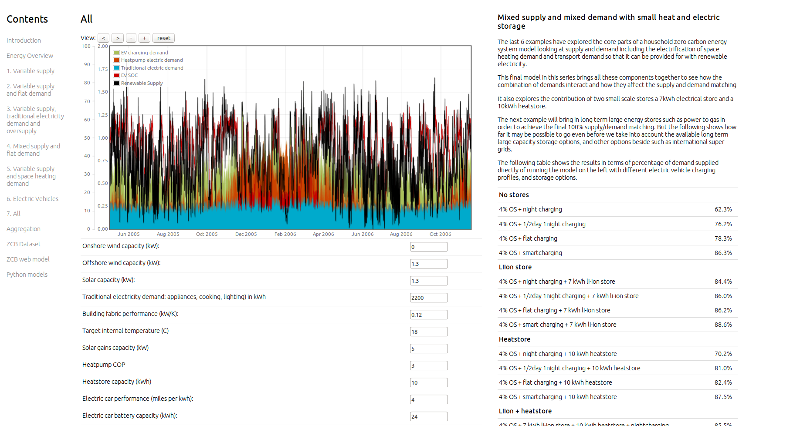
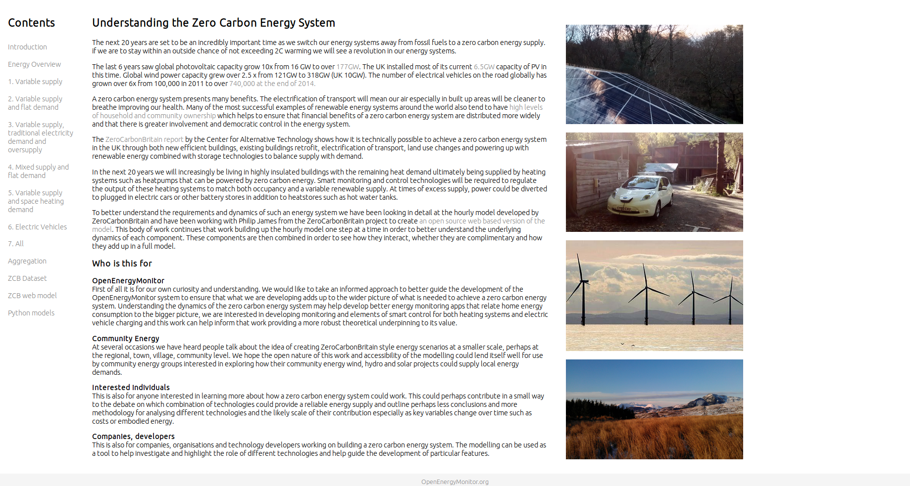

# A series of example models exploring hourly demand and supply for renewable powered domestic electricity, heating with heatpumps and electric vehicles

# Understanding the Zero Carbon Energy System

The next 20 years are set to be an incredibly important time as we switch our energy systems away from fossil fuels to a zero carbon energy supply. if we are to stay within an outside chance of not exceeding 2C warming we will see a revolution in our energy systems.

The last 6 years saw global photovoltaic capacity grow 10x from 16 GW to over 177GW. The UK installed most of its current 6.5GW capacity of PV in this time. Global wind power capacity grew over 2.5 x from 121GW to 318GW (UK 10GW). The number of electrical vehicles on the road globally has grown over 6x from 100,000 in 2011 to over 740,000 at the end of 2014.

A zero carbon energy system presents many benefits. The electrification of transport will mean our air especially in built up areas will be cleaner to breathe improving our health. Many of the most successful examples of renewable energy systems around the world also tend to have high levels of household and community ownership which helps to ensure that financial benefits of a zero carbon energy system are distributed more widely and that there is greater involvement and democratic control in the energy system.

The ZeroCarbonBritain report by the Center for Alternative Technology shows how it is technically possible to achieve a zero carbon energy system in the UK through both new efficient buildings, existing buildings retrofit, electrification of transport, land use changes and powering up with renewable energy combined with storage technologies to balance supply with demand.

In the next 20 years we will increasingly be living in highly insulated buildings with the remaining heat demand ultimately being supplied by heating systems such as heatpumps that can be powered by zero carbon energy. Smart monitoring and control technologies will be required to regulate the output of these heating systems to match both occupancy and a variable renewable supply. At times of excess supply, power could be diverted to plugged in electric cars or other battery stores in addition to heatstores such as hot water tanks.

To better understand the requirements and dynamics of such an energy system we have been looking in detail at the hourly model developed by ZeroCarbonBritain and have been working with Philip James from the ZeroCarbonBritain project to create an open source web based version of the model. This body of work continues that work building up the hourly model one step at a time in order to better understand the underlying dynamics of each component. These components are then combined in order to see how they interact, whether they are complimentary and how they add up in a full model.

## Who is this for

**OpenEnergyMonitor**
First of all it is for our own curiosity and understanding. We would like to take an informed approach to better guide the development of the OpenEnergyMonitor system to ensure that what we are developing adds up to the wider picture of what is needed to achieve a zero carbon energy system. Understanding the dynamics of the zero carbon energy system may help develop better energy monitoring apps that relate home energy consumption to the bigger picture, we are interested in developing monitoring and elements of smart control for both heating systems and electric vehicle charging and this work can help inform that work providing a more robust theoretical underpinning to its value.

**Community Energy**
At several occasions we have heard people talk about the idea of creating ZeroCarbonBritain style energy scenarios at a smaller scale, perhaps at the regional, town, village, community level. We hope the open nature of this work and accessibility of the modelling could lend itself well for use by community energy groups interested in exploring how their community energy wind, hydro and solar projects could supply local energy demands.

**Interested individuals**
This is also for anyone interested in learning more about how a zero carbon energy system could work. This could perhaps contribute in a small way to the debate on which combination of technologies could provide a reliable energy supply and outline perhaps less conclusions and more methodology for analysing different technologies and the likely scale of their contribution especially as key variables change over time such as costs or embodied energy.

**Companies, developers**
This is also for companies, organisations and technology developers working on building a zero carbon energy system. The modelling can be used as a tool to help investigate and highlight the role of different technologies and help guide the development of particular features.
